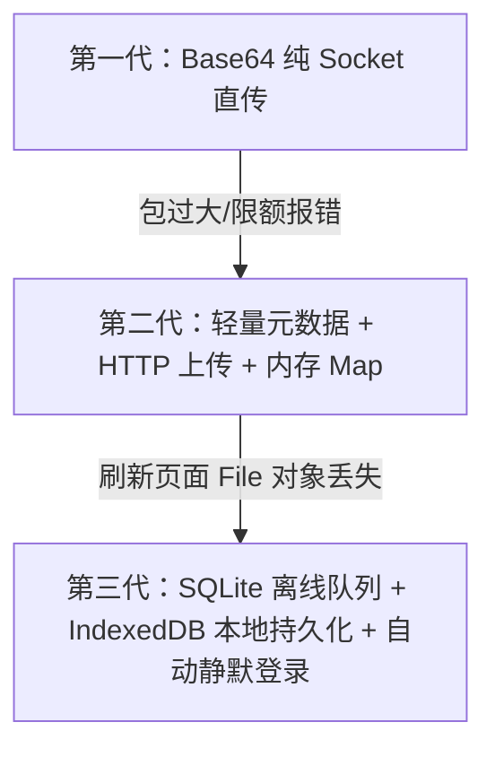

# 离线消息队列与大文件传输 - 架构演进与 Debug 排错经验复盘

> **文档目的**：本文档归纳总结了 MyChat 即时通讯项目中“**离线消息队列、文件传输审批及上线自动补发**”功能的完整开发历程、架构演进过程、遇到的 5 大典型坑点与诊断排查思路，供后续 IM 实时通讯系统的开发与维护参考。

---

## 目录
1. [项目背景与需求概述](#1-项目背景与需求概述)
2. [核心架构演进路线](#2-核心架构演进路线)
3. [5 大典型 Debug 坑点与诊断复盘](#3-5-大典型-debug-坑点与诊断复盘)
4. [最终技术方案实现细节](#4-最终技术方案实现细节)
5. [IM 系统开发经验与最佳实践](#5-im-系统开发经验与最佳实践)

---

## 1. 项目背景与需求概述

MyChat 是一款基于 **Node.js + Socket.IO + SQLite** 架构的高颜值即时通讯系统。

### 核心功能需求
- **文件审批传输**：普通用户可向管理员发起任意文件（PDF、ZIP、DOCX 等，最大 50MB）传输请求，须经管理员侧【同意接收】或【拒绝】后方可开始传输落盘。
- **双端离线消息队列**：
  - 管理员离线时，普通用户发送的文本、图片、文件申请需安全保存，管理员上线后**自动同步离线消息与高亮未读红点**。
  - 普通用户离线时，管理员发送的回复与文件批准决策需安全保存，普通用户上线后**自动拉取回复，若文件被批准，自动补发大文件上传**。

---

## 2. 核心架构演进路线

在开发过程中，文件传输与离线队列架构经历了 **三次重大演进**：



### 第一代：Base64 纯 Socket 直传
- **实现**：前端通过 `FileReader.readAsDataURL` 将文件转为 Base64 字符串，塞入 Socket.IO 的 `user-message` 消息中发给服务端。
- **痛点/缺陷**：
  - 触发 Socket.IO 默认 `maxHttpBufferSize = 1MB` 限制，超大包被 Socket.IO 静默丢弃并断开连接。
  - 试图存入 `localStorage` 时，直接触发 `QuotaExceededError` (5MB 额度超出) 异常导致页面挂起。

### 第二代：轻量元数据 + HTTP 上传 + JS 内存 Map
- **实现**：Socket 仅传输 ~200 字节的文件元数据（文件名、大小、状态），真实 `File` 对象保存在 JS 内存 `pendingFilesMap` 中；管理员同意后调用 HTTP POST `/api/upload` 上传。
- **痛点/缺陷**：
  - 解决了实时大文件丢包问题，但**无法应对离线/刷新场景**：若用户发完申请后刷新或关闭了浏览器，内存 `Map` 被清空。管理员后续批准时，用户端因找不到 `File` 句柄，传输卡在 `已同意，传输保存中...` 无法完成。

### 第三代（最终方案）：SQLite 离线队列 + IndexedDB 持久化 + 静默自动登录
- **实现**：
  1. 服务端 SQLite 保存全量消息与文件状态。
  2. 客户端引入 **`IndexedDB`** 跨页面/跨离线周期持久化待上传的 `File` 对象。
  3. 前端实现**自动静默登录与拉流**，上线自动核对状态并触发补发。

---

## 3. 5 大典型 Debug 坑点与诊断复盘

### 坑点 1：Socket.IO 默认包大小限制导致静默丢包

- **现象**：用户侧选择 2MB 文件点击发送后，UI 显示卡片，但管理员侧收不到任何提醒，服务端日志无记录。
- **诊断过程**：
  - 查看客户端控制台，发现 Socket 发生了 `transport close` 重连。
  - 发现 Socket.IO 默认的 `maxHttpBufferSize` 限制为 `106` (1MB)，而 2MB 文件转为 Base64 后约 2.7MB，超出限制后 Engine.IO 自动关闭了 Connection。
- **解法与教训**：
  - 提升 `maxHttpBufferSize: 1e8` (100MB) 作为保底。
  - **原则**：即时通讯的长连接通道绝对不能用于直传大文件二进制 Payload，必须采用“信令与数据流分离”模式。

---

### 坑点 2：WebSocket 帧与 Chrome DevTools Network 误判

- **现象**：测试人员反馈“点击管理员登录按钮无反应，DevTools Network 抓不到任何 HTTP 请求”。
- **诊断过程**：
  - 实际上登录认证是通过 Socket.IO 实时帧 `socket.emit('join-admin')` 完成的。
  - Chrome DevTools 默认的 `Network -> Fetch/XHR` 只能抓取传统 HTTP 请求，WebSocket 数据帧记录在 `Network -> WS` 选项卡中。
- **解法与教训**：
  - 在排查 IM 系统的通讯故障时，首先区分请求类型（HTTP vs WebSocket），指导测试与开发人员查看 `WS` 分页中的 Frame 数据。

---

### 坑点 3：前端事件监听器与回调函数丢失引发界面挂起

- **现象**：管理员点击登录后，服务端日志连续打印 4 次 `[ADMIN CONNECTED]`，但前端界面一直停留停留在登录弹窗处。
- **诊断过程**：
  - 查看前端控制台，发现抛出了 `Uncaught TypeError: initAdminView is not a function`。
  - 在之前的代码替换调整中，`initAdminView` 与 `socket.on('new-user-message')` 被意外切除，导致服务端成功响应 Ack 回调后，前端在执行回调函数时崩溃中断，未能隐藏弹窗与渲染面板。
- **解法与教训**：
  - 补全 `initAdminView` 与 `new-user-message` 监听器。
  - 代码重构后，必须运行全量静态语法与符号检查（如 `node -c`）。

---

### 坑点 4：页面刷新导致内存 File 对象丢失，离线批准无法补发

- **现象**：普通用户发送文件申请后关闭浏览器。管理员上线点击【同意接收】。普通用户重新打开浏览器上线，卡在“传输保存中...”，文件未成功上传。
- **诊断过程**：
  - 查看用户端代码，先前文件对象存在 `pendingFilesMap`（内存 Map）中。
  - 浏览器关闭或刷新后，JavaScript 运行时环境重建，内存 Map 变为空。即使重新上线拉取到了 `fileStatus: 'approved'`，也无法凭 `msgId` 获取到 File 数据。
- **解法与教训**：
  - 引入浏览器原生 **`IndexedDB`** 数据库 (`IDBFileStore`)。
  - 发起文件申请时，同时将 `File` 对象写入 IndexedDB。IndexedDB 原生支持存储 `Blob/File` 且无 5MB 额度限制。用户重新上线后从 IndexedDB 读取文件并完成 HTTP POST 上传。

---

### 坑点 5：Node.js 后台长进程未重启导致代码变更未生效

- **现象**：完成了 `server.js` 与 `db.js` 的修改后，本地 Chrome 和 Edge 联合测试依然拉不到离线消息。
- **诊断过程**：
  - 查看进程状态，发现后台 `node server.js` 进程已经在后台连续运行了 25 分钟。
  - Node.js 在启动时会将模块载入内存，在未配置 `nodemon` 或未重启进程的情况下，对 `server.js` 与 `db.js` 的文件修改根本没有在运行的 Node 进程中生效。
- **解法与教训**：
  - 强制 kill 掉旧 Node 进程并拉起新服务。修改服务端代码后，切记确认 Node 进程已载入最新代码。

---

## 4. 最终技术方案实现细节

### 1. 服务端消息与离线队列 (`server.js` & `db.js`)
```javascript
// SQLite 离线消息拉取
static getMessages(clientId) {
  const msgs = stmtGetMessages.all(clientId);
  return msgs.map(m => ({
    id: m.id,
    clientId: m.client_id,
    senderRole: m.sender_role,
    fromNickname: m.sender_nickname,
    text: m.text,
    timestamp: m.timestamp
  }));
}

// 离线消息自动推流 (join-user)
socket.on('join-user', ({ nickname, reason, clientId }, callback) => {
  const historyMessages = ChatDatabase.getMessages(cleanClientId);
  callback({
    success: true,
    user: { ... },
    adminOnline: adminSockets.size > 0,
    historyMessages: historyMessages // 自动带回离线消息队列
  });
});
```

### 2. 前端 IndexedDB 大文件持久化 (`idb-store.js`)
```javascript
class IDBFileStore {
  static async saveFile(msgId, file) {
    const db = await this.openDB();
    const tx = db.transaction('pending_files', 'readwrite');
    tx.objectStore('pending_files').put(file, msgId);
  }

  static async getFile(msgId) {
    const db = await this.openDB();
    const tx = db.transaction('pending_files', 'readonly');
    return tx.objectStore('pending_files').get(msgId);
  }
}
```

### 3. 上线自动补发上传 (`app.js`)
```javascript
merged.forEach(async (m) => {
  const parsed = parseFileMsg(m);
  if (parsed && parsed.fileStatus === 'approved') {
    let file = pendingFilesMap.get(m.id);
    if (!file && window.IDBFileStore) {
      file = await IDBFileStore.getFile(m.id); // 从 IndexedDB 提取离线文件
    }
    if (file) {
      await uploadFileToServer(file, m.id, myDeviceId); // HTTP 补发上传
      if (window.IDBFileStore) await IDBFileStore.deleteFile(m.id);
    }
  }
});
```

---

## 5. IM 系统开发经验与最佳实践

1. **信令与媒体流分离**：
   - 即时通讯中，WebSocket 仅用于传递**指令、控制卡片、轻量文本**。
   - 图片、大文件、音视频流必须走标准的 HTTP REST API (如 multipart/form-data) 或 CDN 分块上传。
2. **离线消息与端侧存储设计**：
   - **服务端**：SQLite / MySQL / Redis 负责权威消息队列持久化。
   - **客户端内存**：只放生命周期内的临时状态。
   - **客户端持久化**：简单配置/小文本存 `localStorage`；二进制文件/Blob 句柄存 `IndexedDB`。
3. **幂等性与自动恢复机制**：
   - 消息必须带上客户端生成的 UUID (`msgId`)。
   - 重新上线时，客户端通过 `Map(id -> msg)` 实施本地与服务端消息的去重与合并 (Merge)，保障消息不重复、不遗漏。
